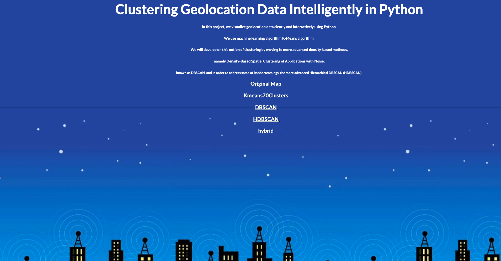

# Clustering Geolocation Data Intelligently in Python

### Introduction
In this project, we visualize geolocation data clearly and interactively using Python.
We use machine learning algorithm K-Means algorithm.
We will develop on this notion of clustering by moving to more advanced density-based methods,
namely Density-Based Spatial Clustering of Applications with Noise,
known as DBSCAN, and in order to address some of its shortcomings, the more advanced Hierarchical DBSCAN (HDBSCAN).

Project.ipynb implements the algorithms to generate htmls.
You can run geolocationApp.html to see the detailed results.

### Demo
Here is a short video to briefly show this project.
[]
(https://youtu.be/vqgPzI8-uqE)